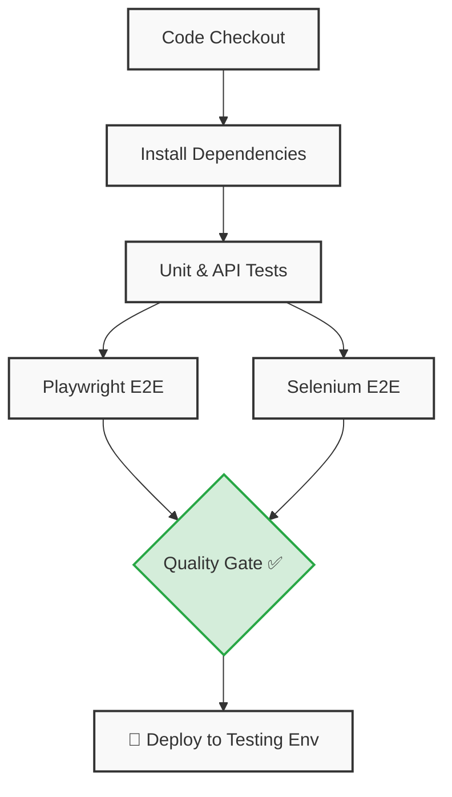

# Automated Test Pipeline

> Automated Testing in DevOps CI/CD Pipeline — Unit, API, and UI/E2E tests with quality gates.


## Project Structure

```
├── .github/workflows/
│   └── ci.yml                 # GitHub Actions CI/CD pipeline
├── src/
│   ├── app.js                 # Express application (API + static files)
│   ├── server.js              # Server entry point
│   ├── public/
│   │   └── index.html         # Calculator UI
│   └── utils/
│       └── calculator.js      # Calculator utility module
├── tests/
│   ├── unit/
│   │   └── calculator.test.js # Jest unit tests
│   ├── api/
│   │   └── api.test.js        # Supertest API tests
│   └── e2e/
│       ├── playwright/
│       │   └── app.spec.js    # Playwright E2E tests
│       └── selenium/
│           └── app.test.js    # Selenium E2E tests
├── playwright.config.js       # Playwright configuration
├── package.json
└── README.md
```

## Quick Start

```bash
# 1. Install dependencies
npm install

# 2. Install Playwright browsers
npx playwright install --with-deps chromium

# 3. Start the app locally
npm start
# → http://localhost:3000
```

## Running Tests

| Command | What it runs |
|---|---|
| `npm test` | All test suites sequentially |
| `npm run test:unit` | Jest unit tests |
| `npm run test:api` | Supertest API tests |
| `npm run test:e2e:playwright` | Playwright E2E tests (auto-starts server) |
| `npm run test:e2e:selenium` | Selenium E2E tests (requires Chrome) |

## CI/CD Pipeline

The GitHub Actions workflow (`.github/workflows/ci.yml`) runs on every push/PR to `main`:



### Quality Gates
- **Unit & API tests** must pass before E2E tests begin
- **All E2E tests** (Playwright + Selenium) must pass before deployment
- Pipeline **fails immediately** if any test fails — no deployment occurs

## Test Frameworks

| Framework | Purpose | Layer |
|---|---|---|
| **Jest** | Unit testing | Individual functions |
| **Supertest** | API endpoint testing | HTTP request/response |
| **Playwright** | UI/E2E automation | Full user flows (Chromium, Firefox, WebKit) |
| **Selenium** | Cross-browser E2E | Browser automation validation (Chrome) |

## Sample Application

The app is a **Calculator** with:
- A web UI at `/` for interactive use
- A REST API at `POST /api/calculate` accepting `{ a, b, operation }`
- A health-check at `GET /api/health`

This serves as the system under test for all test suites.
